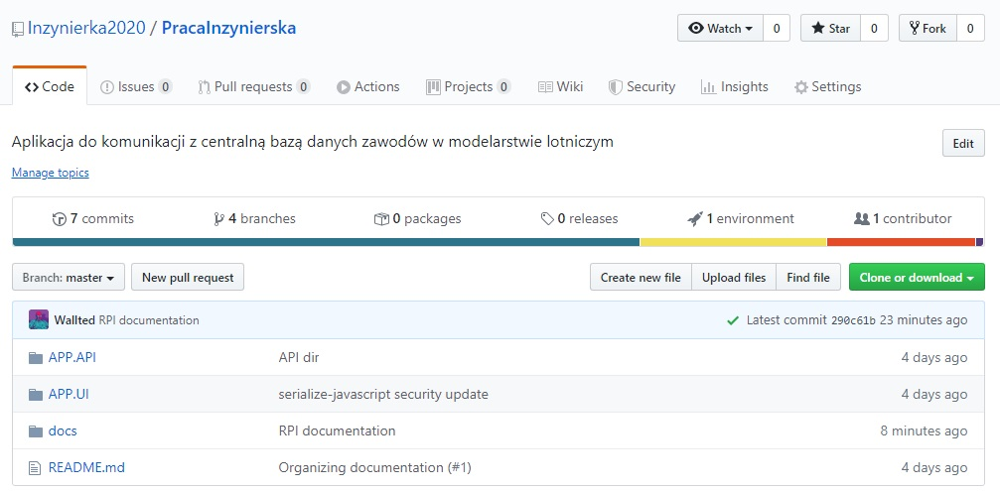

### REALIZACJA PROJEKTU INŻYNIERSKIEGO 
***PIOTR ADAMCZYK 151466***  
***GRZEGORZ CHOIŃSKI 165105***  
***WT_12A-4***  

***ETAP 1 - 17.03.2020***
# ORGANIZACJA I INFRASTRUKTURA PROJEKTU 

## SPIS TREŚCI
 1. [Opis projektu i produktu](#1-opis-projektu-i-produktu)
 2. [Interesariusze i użytkownicy, persony](#2-interesariusze-i-użytkownicy-persony)
 3. [Zespół](#3-zespół)
 4. [Komunikacja z zespole i z interesariuszami](#4-komunikacja-z-zespole-i-z-interesariuszami)
 5. [Współdzielenie dokumentów i kodu](#5-współdzielenie-dokumentów-i-kodu)
 6. [Narzędzia](#6-narzędzia)
 7. [Podgląd repozytorium Githuba](#7-podgląd-repozytorium-githuba)

## 1. Opis projektu i produktu
Tematem projektu jest “Aplikacja do zarządzania wyścigami modeli lotniczych”. Temat adresuje problem związany ze zbieraniem danych podczas takich zawodów i synchronizacji ich z centralną bazą danych znajdującej się w USA. Najważniejszym problemem jest sytuacja braku połączenia z siecią w lokacjach położonych w górach i na różnych zboczach. Ma być dostępna do użytkowania na urządzeniach mobilnych – najlepiej na tablecie z androidem.
## 2. Interesariusze i użytkownicy, persony
Interesariuszami są osoby należące do projektu,  promotor **dr inż. Paweł Sosnowski** oraz klient **mgr inż Andrzej Partyka**, który zlecił wytworzenie aplikacji. Dodatkowymi udziałowcami mogą być uczestnicy zawodów i sędziowie, w przypadku gdyby klient zdecydował się z nimi w przyszłości skontaktować. 

### Persona:

**Andrzej Partyka**, 44 lata  
Wykształcenie: mgr inż.  
Stanowisko: Starszy specjalista naukowo-techniczny  
Hobby: lotnictwo, modelarstwo  

Andrzej poza swoim regularnym stanowiskiem na uczelni wyższej, hobbystycznie sędziuje w wyścigach modeli lotniczych. W trakcie zawodów sprawuje pieczę nad centralnym zegarem konsolidującym osprzętowanie takie jak przyciski do mierzenia czasów na bazach oraz wiatromierz. Wciska na nim przyciski startowe, a wszystkie otrzymane czasy z zegara, przed wystartowaniem następnego zawodnika muszą znaleźć się na kartce, które potem w wolnej chwili zostaną manualnie wprowadzone uzupełniając dane o pozostałe parametry do centralnej bazy danych w USA przez Internet.
Jego wizją jest posiadanie aplikacji zbierającej dane z zegara za niego. Andrzej jako jej użytkownik może w trakcie imprezy skupić się na prawidłowym rozegraniu zawodów, które dzięki automatycznej synchronizacji danych z centralną bazą w USA przebiegną sprawniej. 
Użytkownikami aplikacji raczej są ludzie starsi, niekoniecznie zaznajomieni z technologią. Z tego powodu interfejs naszego systemu musi być czytelny, z prostymi funkcjonalnościami i odpowiednimi zabezpieczeniami przed zacieraniem danych. Jako że charakterystyką zawodów są warunki polowe, aplikacja powinna zapewniać moduł offline w razie braku dostępu do internetu.

## 3. Zespół

| IMIĘ I NAZWISKO | E-MAIL | TELEFON | GITHUB |
| :-------------: |:-------------:| :-----:| :---: |
| PIOTR ADAMCZYK | piotrek.adamczykk@gmail.com | 503378559 | padamchick |
| GRZEGORZ CHOIŃSKI | grzegorzchoinski97@gmail.com | 509287701 | Wallted |

###### Tabela 1. Dane członków zespołu

## 4. Komunikacja z zespole i z interesariuszami

Komunikacja pomiędzy członkami odbywać się będzie przez **Messenger**, rzadziej przez telefon. Spotkania projektowe odbywają się cyklicznie co tydzień we wtorki w godzinach **10:00-12:00** zdalnie przez **Google Hangouts**. W spotkaniu biorą udział członkowie zespołu wraz z promotorem. Klient w razie potrzeby jest dostępny w swoim pokoju na uczelni – wyraził również zgodę na kontakt telefoniczny. Komunikacja w zespole w ramach pracy odbywać się będzie przy wykorzystaniu narzędzi z punktu 6. Spotkania osobiste z promotorem i klientem odbywać się będą na uczelni w pokoju promotora. w momencie, gdy aplikacja będzie przechodziła stadia **MVP**, **Alfa**, **Beta** oraz **Release**, które są sprecyzowane na średnio co miesiąc.

## 5. Współdzielenie dokumentów i kodu

Kod projektu będzie współdzielony poprzez rozproszone repozytorium **Github** dostępne pod adresem: 
[https://github.com/Inzynierka2020/PracaInzynierska](https://github.com/Inzynierka2020/PracaInzynierska).  
Dostęp do repozytorium odbywa się za pomocą mechanizmu organizacji na platformie **Github**, do której należą wszyscy członkowie zespołu projektowego. Osoby spoza projektu mają jedynie prawo do odczytu.

Dokumentacja projektowa będzie współdzielona poprzez wydzielony katalog w repozytorium **Github**. Dzięki takiemu rozwiązaniu można w łatwy sposób uzyskać historię zmian dokumentacji. Wykorzystany również będzie moduł **Github Pages**, który bezpośrednio z repozytorium udostępnia pliki **Markdown** do natychmiastowego przeglądania.
Dokumentacja w tej przystępnej formie jest dostępna pod adresem  
[https://inzynierka2020.github.io/PracaInzynierska/](https://inzynierka2020.github.io/PracaInzynierska/).

Osobą odpowiedzialną za porządek w dokumentacji jest **Grzegorz Choiński**, który zarządza repozytorium.

Schemat nazewnictwa dokumentów wygląda w sposób następujący:  
***rok-miesiąc-dzien_vNUMERwersji_Nazwa-pliku***

## 6. Narzędzia
Narzędzia, które wykorzystujemy w projekcie:
 - wspierające komunikację:
   - Mail (oficjalna korespondencja)
   - Messenger (kanał komunikacyjny)
 - wspomagające organizację projektu:
   - Asana (zarządzanie projektem)
   - ERD Constructor (projektowanie bazy danych)
 - wspierające dokumentację
   - MS Word (do tworzenia dokumentacji)
   - system składni Markdown (MD)
 - wspomagające współdzielenie kodu i plików
   - Github (repozytorium dla kodu i dokumentacji)
 - wspomagające tworzenie kodu, aplikacji, testowania
   - IntelliJ (IDE)
   - Visual Studio Code (IDE)
   - GitBash (klient do zarządzania repozytorium z poziomu terminala)
   - Docker (narzędzie do deployu aplikacji)

## 7. Podgląd repozytorium Githuba

###### Ryc. 1. Organizacja

###### Ryc. 2. Członkowie organizacji mający dostęp do repozytorium

###### Ryc. 3. Repozytorium

###### Ryc. 4. Folder z dokumentacją

###### Ryc. 5. Moduł GithubPages pozwalający na sprawne przeglądanie dokumentacji Markdown.
