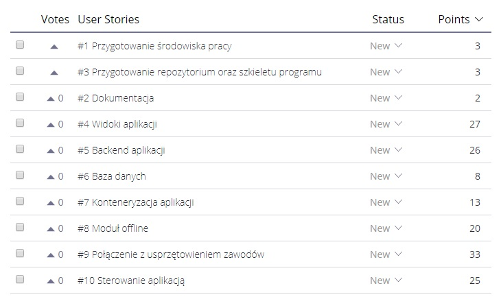
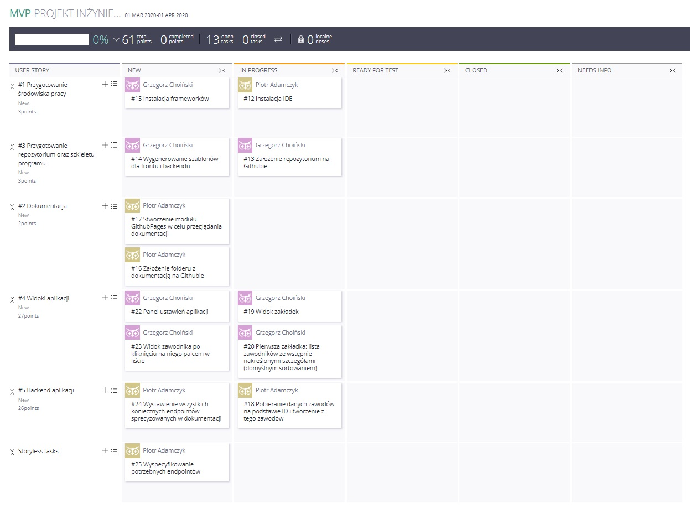
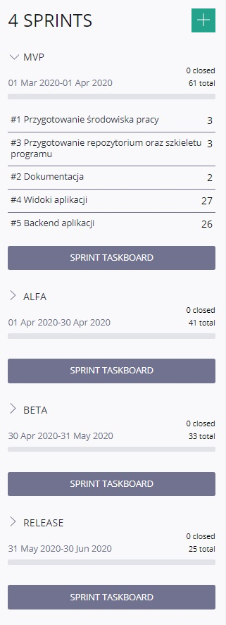

### REALIZACJA PROJEKTU INŻYNIERSKIEGO 
***PIOTR ADAMCZYK 151466***  
***GRZEGORZ CHOIŃSKI 165105***  
***WT_12A-4***  

***ETAP 3 - 31.03.2020***
# BACKLOG PRODUKTU 

## SPIS TREŚCI
 1. [O projekcie i produkcie](#1-o-projekcie-i-produkcie)
 2. [Scenariusz użycia produktu](#2-scenariusz-użycia-produktu)
 3. [Backlog produktu](#3-backlog-produktu)
 4. [Założenia i dobór zakresu sprintu 1](#4-założenia-i-dobór-zakresu-sprintu-1)
 5. [Cel sprintu](#5-cel-sprintu)
 6. [Backlog sprintu 1](#6-backlog-sprintu-1)
 7. [Sprinty](#7-sprinty)

## 1. O projekcie i produkcie
Temat projektu: “Aplikacja do komunikacji z centralną bazą danych zawodów w modelarstwie lotniczym”

Projekt ma charakter wykonawczy dla klienta. Klientem jest jeden z sędziów w zawodach w modelarstwie lotniczych, którego aplikacja będzie wspomagała komunikację z centralną bazą danych lotów oraz urządzeniami typu zegar na miejscu.

Produkt składa się z progresywnej aplikacji webowej użytkowanej domyślnie na urządzeniu mobilnym w trudnym terenie.

## 2. Scenariusz użycia produktu
Andrzej jest sędzią zawodów modeli lotniczych. Do tej pory wszystkie wyniki musiał zapisywać ręcznie, co było dla niego bardzo uciążliwe, czasochłonne. Ponadto zawodnicy musieli długo czekać, aby sprawdzić swoje wyniki. Jednak z myślą o poprawie doli Andrzeja powstała aplikacja mająca na celu zautomatyzowanie całego procesu. Zbliżają się zawody, więc zasiada on do urządzenia z aplikacją. Jego oczom ukazuje się strona startowa, na której wpisuje ID zawodów celem wystartowania imprezy. Po tej czynności jego oczom ukazuje się lista zawodników, która uprzednio została wprowadzona przez organizatorów do internetowej centralnej bazy danych F3XVault. Lista ta jest jednocześnie klasyfikacją generalną całych zawodów. W liście powinny zawrzeć się m. in. imię i nazwisko zawodnika, nr licencji, znormalizowany wynik wyliczony na podstawie poszczególnych zamkniętych kolejek, punkty karne, procentowy wynik (również normalizacja, na podstawie punktów).

Zawody odbywają się w kolejkach, zatem sędzia musi założyć kolejkę. Uważa, że jest wygodnie, jeżeli kolejki są uporządkowane jak zakładki. Tworzy zatem nową zakładkę. W tym momencie jego zadaniem jest ręczne ustawienie numeru kolejki oraz decyzja o podziale na grupy w tej kolejce (musi to zrobić przed startem kolejki):
- sędzia postanowił, że ze względu na warunki pogodowe zostaje wprowadzony podział na grupy. Możliwe jest nawet, że start którejś grupy nie odbędzie się ani dzisiaj, ani w tym samym miejscu. Podział ten jest już ustalony wcześniej - w momencie tworzenia list zawodników przed zawodami i wprowadzaniu ich do internetowej bazy danych. W danej grupie nie może być mniej niż 10 zawodników;
- sędzia postanowił, że nie ma takiej potrzeby, podział na grupy jest wyłączony w tej kolejce. Zawodnicy latają “ciurkiem”. Podział na grupy zwykle jest już wprowadzony w bazie internetowej. Sędzia wybiera czy on obowiązuje czy nie.

Na wierzchu w aplikacji sędzia cały czas ma specjalny panel, w którym widoczne są wszystkie informacje na temat godziny, prędkości wiatru i jego kierunku. Dzięki temu ma pod ręką w jednym miejscu wszystkie kluczowe informacje, na podstawie których podejmuje decyzje o podziale kolejki na rundy, czy też anulowaniu kolejki. Nadeszła pora na start pierwszego zawodnika. W tym celu wybiera zawodnika z listy zawodników w zakładce z kolejką. Dzięki alfabetycznej liście nazwisk zajmuje mu to tylko chwilę.

Sędzia po wystartowaniu zawodnika otrzymuje panel zarządzania zawodnikiem w spektrum obowiązującej kolejki. Widzi jego wszystkie dane personalne, a także dane na temat przelotu poszczególnej z 10 baz. Tutaj również ustawia mu numer grupy:
- podział na grupy - sędzia jest w stanie przypisać numer konkretnej grupy zawodnikowi
- bez podziału na grupy - zawodnik domyślnie posiada numer grupy 1 Teraz jest moment, kiedy aplikacja nasłuchuje danych od urządzeń takich jak zegar, wiatromierz. Na bieżąco wszystkie informacje pojawiają się w panelu. W przypadku chęci dodania punktów karnych zawodnikowi, również jest taka możliwość. Po locie, sędzia zapisuje dane zawodnika na temat tego lotu, co wyłącza panel i wysyła dane bazie internetowej. Widoczna jest informacja, czy zapisano dane w bazie internetowej, czy może trzeba to powtórzyć.
- przelot zakończony powodzeniem nie wymaga dodatkowych czynności
- przelot zakończony niepowodzeniem wysyła dane jakie ma, a zadaniem sędziego jest ustawienie DNF (Did Not Finish) temu przelotowi
- przelot w ogóle się nie zaczął - sędzia ustawia przelotowi DNS (Did Not Start)

Andrzej jest zadowolony, zamiast zapisywać czasy każdego okrążenia może spokojnie obserwować przebieg zawodów kontrolując jedynie parametry kluczowe, jak kierunek oraz prędkość wiatru, gdyż wie, że czasy zostaną pobrane automatycznie oraz po zakończeniu przelotu od razu zostaną wysłane do bazy. Po powrocie do listy zawodników, lista zawodników w tej kolejce podzieliła się na dwie części - do górnej zaczęli trafiać zawodnicy, którzy odbyli lot w tej kolejce, do tej dolnej ci, którzy jeszcze nie wystartowali. Lista górna jest segregowana po ilości punktów, natomiast dolna alfabetycznie wg. nazwisk. Lista powinna zawierać imię i nazwisko zawodnika, czas przelotu, punkty karne oraz znormalizowany wynik punktowy.

Kolej następnego zawodnika - sędzia wybiera kolejnego zawodnika z listy, ponownie otwierając panel tego zawodnika i tak do wyczerpania zawodników.
- Wszyscy zawodnicy odbyli (lub DNS) swoje loty - sędzia zapisuje daną kolejkę.
- Istnieje potrzeba anulowania kolejki - sędzia anuluje kolejkę (nie traci jednak danych z tej kolejki, ta kolejka nie wlicza się tylko do punktacji)

Sędzia przełącza zakładkę na pierwszą, która jest klasyfikacją zawodów. Tutaj jest w stanie przedstawić wyniki imprezy na podstawie wszystkich zamkniętych kolejek (z uwzględnieniem punktów ujemnych).

Nadchodzi nowa kolejka - sędzia tworzy nową zakładkę.

Po przelocie ostatniego zawodnika w ostatniej rundzie Andrzej wybiera opcję “zakończ zawody” i może resztę dnia spędzić z rodziną, gdyż wie, że całą dotychczasową papierkową robotę wykonała za niego aplikacja. 

## 3. Backlog produktu
- Narzędzie wspomagające: taiga.io
- User stories w backlogu posortowane są według kolejności implementacji.
- Story points: 1-40, gdzie 1 to nieskomplikowana funkcjonalność, a 40 to bardzo złożona i skomplikowana funkcjonalność.

###### Ryc. 1. Backlog produktu

## 4. Założenia i dobór zakresu sprintu 1

- Długość trwania sprintu: 1 miesiąc
- Przewidywana ilość sprintów: 4 sprinty
- Pojemność zespołu: 50 punktów
- Rezerwa w pojemności: 10 punktów
- Zakładana prędkość: 40 punktów
- Założenia sprintu: 
   - Omówienie sposobu pracy i stworzenie harmonogramu. Opracowanie backlogu productu. Wizja projektu. Przygotowanie środowiska pracy oraz repozytrium. Podział pracy pomiędzy członków zespołu. Zaprojektowanie i próba implementacji widoków oraz stworzenie działającego backendu aplikacji.

- Uzasadnienie wyboru elementów backlogu: 
  - Powyższe założenia są niezbędne do rozpoczęcia efektywnej pracy zespołowej. Dzięki przygotowaniu podstawowych elementów backlogu, projekt jest prowadzony w sposób przemyślany. Z racji, że projekt ma być skończony w 4 miesiące, po pierwszym sprincie wymagane jest, aby dostarczyć podstawową wersję produku, w oparciu o której będą rozwijane następne User Stories.

## 5. Cel sprintu

Z punktu widzenia interesariuszy, najważniejsza wartość po sprincie 1 to sklasyfikowany i zpriorytetyzowany projekt, w którym istotną rolą jest praca zespołowa wszystkich członków zespołu w taki sposób, aby każda osoba była w pełni świadoma zakresu swoich obowiązków oraz głównych scenariuszy użycia. Ze względu na szybki deadline, klient chce jak najszybciej mieć namacalny produkt, na podstawie którego będzie wywierał wpływ na zespół i kierunek projektu.

## 6. Backlog sprintu 1

###### Ryc. 2. Backlog sprintu

## 7. Sprinty

###### Ryc. 3. Sprinty